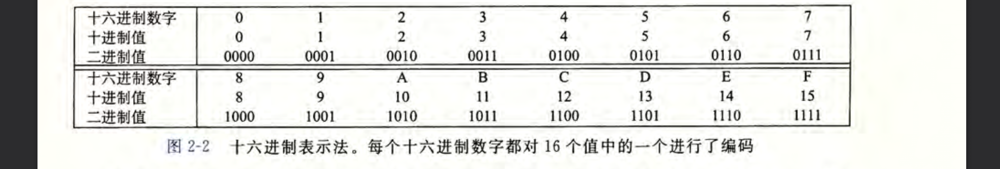
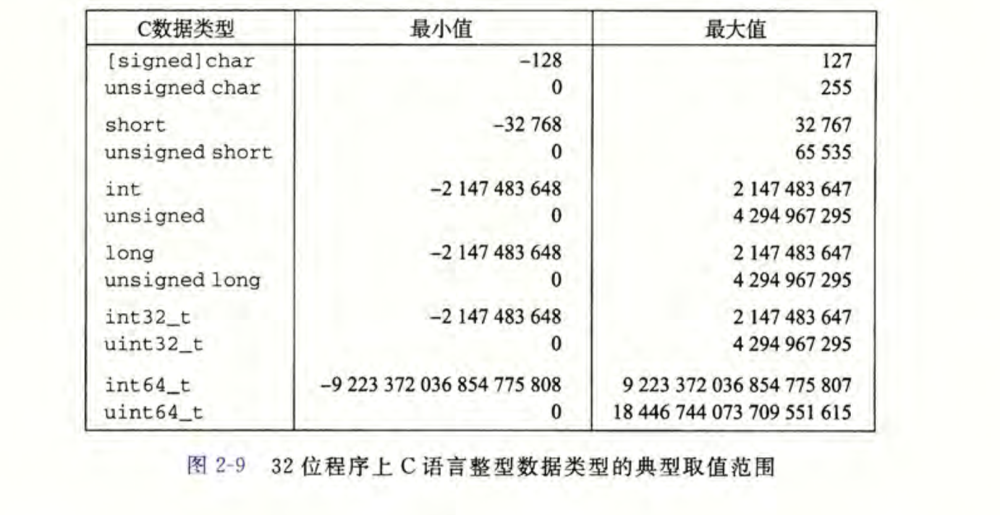
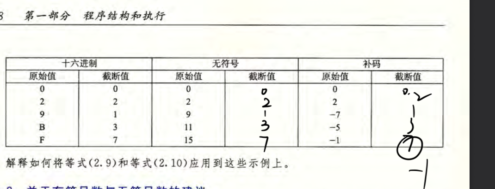

# 2.1信息存储
## 2.1.1十六进制表示
1.一个字节由8位组成。
2.十六进制，二进制，十进制之间关系

3

## 2.1.2字数据大小

# 2.2整数表示
## 2.21 整数类型

无符号数>=0
注：取值范围不对称（与后面补码表示方式和计算有关）
## 2.22-2.25 有无符号数的编码
1.
（tips:
T（int)：表示有符号数
U(Unsigned int)：表示无符号数
B：表示二进制)
### 二进制转化成无符号整数：

B2U是一个函数，转化二进制（无符号编码）成无符号整数
### 二进制转化成有符号整数：

B2T是一个函数，转化二进制（补码编码）成有符号整数

唯一性：一个二进制编码对应一个有符号整数或无符号整数
2.
![[Pasted image 20260218210815.png]

UMax表示无符号数最大值
TMax表示有符号数最大值
注：-1和UMax有同样二进制位
3.
### 有符号数和无符号数相互转换

有符号数转化无符号数（结果是无符号数）

无符号数转化成有符号数
本质：二进制表示形式不变，解释位的形式（计算符号位方式）改变了

4
### c语言有符号数和无符号数的比较
原理

例题：

U后缀：这个数是无符号数

## 2.26到2.27 不同大小数据类型转化（不同二进制位的转化）
### 扩展（小转大）：
无符号数：二进制开头加0。
原理：零扩展

有符号数：

原理：符号扩展
比如二进制位【101】转化成【1101】，【011】转化成【0011】

### 截断（大转小）
w位转化成k位（w>=k）

B2T理解成先进行无符号数的截断转化成无符号数，然后无符号数转化成有符号数
对比理解：
十进制数111100（w=6）转化1100（k=4）
111100%10000(10^4)=1100
练习：

错题：
在补码计算出无符号数7的时候，要转化成有符号数，先比较

7和TMAX(阈值)，然后超出的话，7-2^k.

这个TMax和TMin取值方式要区别清楚
